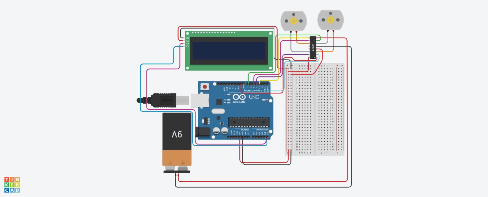

# Arduino-L298D-LCD-Control
مشروع تينكركاد لالتحكم بمحركين DC بواسطة L298D وعرض الحالة على شاشة I2C LCD.
# 🤖 مشروع تاسك الأردوينو: التحكم بالمحركات والشاشة

هذا المشروع هو تطبيق عملي لتاسك تدريبي على منصة Tinkercad. يتضمن المشروع بناء دائرة للتحكم في حركة روبوت (محركين DC) وعرض حالته الحالية على شاشة LCD.

---

## 🎯 الهدف من المشروع

الهدف الأساسي هو برمجة متحكم أردوينو (Arduino Uno) لتنفيذ تسلسل حركي محدد وعرض كل خطوة على الشاشة:

1.  **بناء الدائرة:** توصيل محركين DC مع مشغّل L298D، وربط شاشة I2C LCD.
2.  **برمجة التسلسل الحركي:**
    * التحرك **للأمام** لمدة 30 ثانية.
    * التحرك **للخلف** لمدة 60 ثانية (دقيقة).
    * **التناوب (يمين ويسار)** لمدة 60 ثانية (دقيقة).
3.  **عرض الحالة:** إظهار نص على الشاشة (مثل "Moving: Forward") يتوافق مع الحركة الحالية.

---

## ⚙️ المكونات المستخدمة

* Arduino Uno R3
* L298D Motor Driver
* 2 x DC Motor
* LCD 16x2 I2C
* Breadboard (لوحة تجارب)
* 9V Battery (بطارية 9 فولت)

---

## 💡 الناتج النهائي

تم إكمال الدائرة بنجاح على Tinkercad. عند تشغيل المحاكاة، تعمل المحركات والشاشة بالتسلسل المطلوب تماماً، حيث تعرض الشاشة الحالة الصحيحة لكل حركة.

* **رابط المشروع على Tinkercad:**
    * `[اضغط هنا لمشاهدة الدائرة التفاعلية](ضع-رابط-تينكركاد-الخاص-بك-هنا)`

---

## 🔧 التحديات والحلول

واجهت بعض التحديات أثناء التوصيل والبرمجة، وتم حلها كالتالي:

1.  **تحدي: توزيع الطاقة**
    * **المشكلة:** لم يكن منفذ `5V` واحد في الأردوينو كافياً لتشغيل كل من مشغّل المحرك L298D وشاشة الـ LCD.
    * **الحل:** استخدام لوحة التجارب (Breadboard) كـ "موزع طاقة" لأخذ خطوط `5V` و `GND` من الأردوينو وتوزيعها على القطع المتعددة.

2.  **تحدي: الشاشة لا تعمل (التحدي الأكبر)**
    * **المشكلة:** بعد توصيل شاشة الـ I2C بشكل صحيح وتشغيل المحاكاة، كانت المحركات تعمل لكن الشاشة بقيت فارغة.
    * **الحل:** المشكلة لم تكن في الأسلاك، بل في إعدادات الشاشة داخل Tinkercad. تم حلها عبر خطوتين:
        1.  **تعديل نوع الشاشة (Type)** في إعدادات قطعة الـ LCD.
        2.  **تعديل عنوان الشاشة (Address)** في الكود. تم تغيير العنوان الافتراضي `0x27` إلى `0x20` ليتطابق مع العنوان الذي حدده Tinkercad.

---

## 🎬 صور من المشروع

### 1. مخطط التوصيلات (Wiring Diagram)

### 2. الدائرة أثناء التشغيل (Working Simulation)

---

## 🗂️ ملفات المشروع

### 1. الكود (Arduino Code)

يمكنك الاطلاع على الكود الكامل للمشروع من خلال الرابط التالي:
* **[ملف الكود (Arduino_Motor_Task.ino)](./Arduino_Motor_Task.ino)**

### 2. ملف تصميم اللوحة (Board File)
* **[ملف الكود (Fabulous Jaiks-Kieran.brd)](./Fabulous Jaiks-Kieran.brd)**
Fabulous Jaiks-Kieran.brd

هذا الملف يحتوي على بيانات تصميم لوحة الدائرة (PCB) كما تم تصديرها من Tinkercad.
